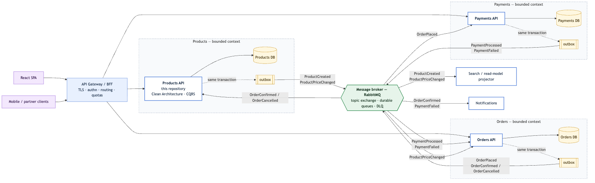
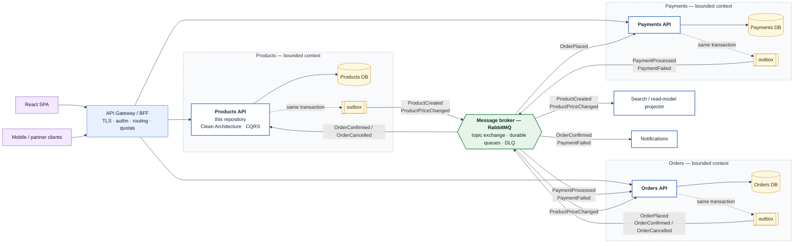
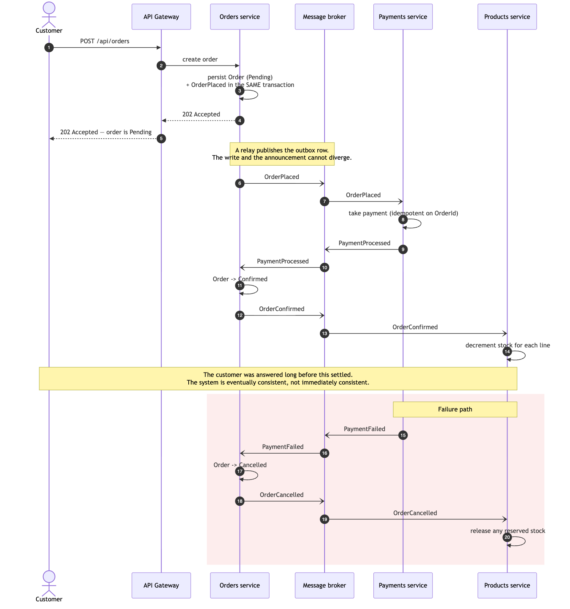
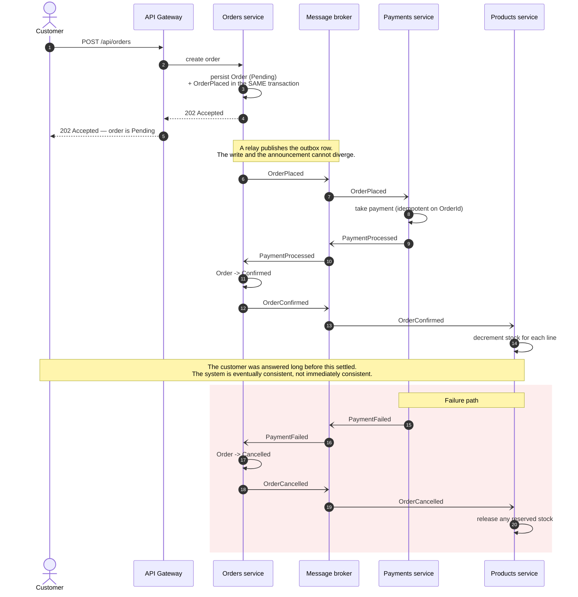

# Architecture

How this Products service fits into a wider event-driven microservices estate,
and why it is put together the way it is.

---

## 1. Service topology



<details>
<summary>Mermaid source (renders inline on GitHub)</summary>



</details>

### Who publishes what, and who listens

| Event | Published by | Consumed by | Why the consumer cares |
|---|---|---|---|
| `ProductCreated` | Products | Search, Notifications | Index the new item; announce it. |
| `ProductPriceChanged` | Products | Orders, Search | Orders re-checks baskets against current pricing. |
| `OrderPlaced` | Orders | Payments | Trigger to take payment. |
| `PaymentProcessed` | Payments | Orders | Move the order to Confirmed. |
| `PaymentFailed` | Payments | Orders, Notifications | Cancel the order; tell the customer. |
| `OrderConfirmed` | Orders | Products, Notifications | Decrement stock; send confirmation. |
| `OrderCancelled` | Orders | Products | Release reserved stock. |

Each bounded context owns its datastore outright. No service reads another's
tables. That is the property that makes the boundaries real rather than
decorative: if Orders could query the Products database, the two would be one
system with two deployment units — all of the operational cost of microservices
and none of the independence.

---

## 2. An asynchronous flow, end to end



<details>
<summary>Mermaid source</summary>



</details>

The important detail is what is *absent*: at no point does one service call
another synchronously. Orders does not wait for Payments. Payments does not ask
Products whether stock exists. Each reacts to a fact that has already happened
and publishes a fact of its own.

The customer receives `202 Accepted` with the order in `Pending`, not `201
Created` with a confirmed order — the honest answer, because at that instant
nothing has been paid and no stock has moved. Returning `201 Confirmed` would be
claiming an outcome the system has not yet reached.

---

## 3. Why events rather than direct calls

**Availability compounds badly in synchronous chains.** If Orders calls Payments
which calls Products, the flow needs all three up at once. At 99.9% each, the
chain is about 99.7% — roughly a day of downtime a year that no individual
service is responsible for. With a broker in between, Payments can be down for
ten minutes and orders keep being accepted; the queue drains when it returns.
The work is delayed, not lost.

**Load spikes become queue depth instead of failures.** A synchronous chain
propagates a traffic surge to every downstream service simultaneously, and the
slowest one decides the user's experience. A queue absorbs the spike and lets
consumers work at their own rate. Queue depth is also a far better scaling signal
than CPU — it measures work outstanding rather than effort expended.

**Adding a consumer stops being a change to the producer.** Search and
Notifications in the diagram subscribe to events Products already publishes.
Products was not modified, redeployed, or even told. With direct calls, every new
interested party is a code change and a release in the *producing* service, which
is how a "microservice" quietly becomes a distributed monolith.

**Temporal decoupling removes a whole class of deployment coupling.** Services can
be deployed independently because they do not need each other awake at the same
moment.

### What it costs — honestly

Nothing here is free, and pretending otherwise is how teams end up with a
distributed system they cannot debug.

- **Eventual consistency is a product decision, not a technical one.** Between
  `OrderPlaced` and `OrderConfirmed` the order exists and is not paid. The UI has
  to show that state, support has to understand it, and someone has to decide what
  happens if it never resolves. That conversation belongs with the product owner
  before the first line of code.
- **Every consumer must be idempotent.** Brokers deliver at least once. A
  redelivered `PaymentProcessed` must not charge twice — hence the "idempotent on
  OrderId" note in the diagram. This is the single most common source of bugs in
  event-driven systems, and it is the consumer's problem to solve, every time.
- **Debugging spans services.** "Where did this order go" becomes a question
  across several logs and a broker. Correlation IDs propagated through message
  headers and distributed tracing are not optional extras; without them the system
  is genuinely hard to reason about. This service already stamps a `traceId` on
  every response and log entry for exactly that reason.
- **Ordering is not guaranteed across partitions.** Two `ProductPriceChanged`
  events for the same product can arrive out of order. Either partition by
  aggregate id, or carry a version and let consumers discard stale updates.
- **Schema changes are now a contract negotiation.** An event with a published
  shape is an API. Adding a field is safe; removing or repurposing one breaks
  consumers you may not know about.

### Where synchronous calls still win

Events are not universally correct. Query paths that need an immediate, consistent
answer — "is this token valid", "what is this product right now" — should stay
synchronous request/response. The gateway calling Products over HTTP for a read is
the right design; it is only *state changes that fan out* which benefit from
events. Using a broker for a simple lookup adds latency and failure modes for
nothing.

---

## 4. RabbitMQ or Kafka?

The diagram shows **RabbitMQ**, for reasons specific to this workload:

- The traffic is business events at human scale — thousands per minute, not
  millions per second. Kafka's throughput advantage buys nothing here.
- The interaction is competing consumers on a work queue, which is RabbitMQ's
  native model. Kafka's consumer-group-per-partition model is more machinery than
  this needs.
- Per-message acknowledgement, dead-letter queues and delayed retry are built in.
  On Kafka these are patterns you assemble yourself.
- Operationally it is far lighter, which matters when the team is small.

**Kafka would be the better answer** if requirements changed in specific ways: if
events needed to be retained and replayed to rebuild a read model from scratch; if
the system moved to genuine event sourcing where the log *is* the source of truth;
if throughput reached the hundreds of thousands per second; or if a stream
processing layer were wanted over the event history.

That is the real trade: RabbitMQ is a message broker — once delivered and
acknowledged, a message is gone. Kafka is a durable, replayable log. Replay is the
deciding capability, not throughput.

---

## 5. How this service already fits

The Products API in this repository is not a monolith with microservice
aspirations bolted on. The seam is already present and load-bearing.

**Domain events exist and are raised by the aggregate.** `Product.Create` raises
`ProductCreatedDomainEvent`; `ChangePrice` raises `ProductPriceChangedDomainEvent`
carrying *both* the old and new price, because a consumer needs the delta and
cannot reconstruct it from the new state alone. That is the difference between an
event and a state notification.

**They are dispatched after the transaction commits.** `ProductsDbContext.SaveChangesAsync`
collects pending events, saves, then dispatches. No handler can react to a change
that is subsequently rolled back.

**The domain does not know how they are delivered.** `IDomainEvent` carries no
MediatR reference. An Application-layer wrapper adapts it to a MediatR
notification. Publishing to a broker instead changes that one adapter.

### What it would take to publish for real

The handler that today writes a log line is the extension point:

```csharp
// Products.Application/Products/EventHandlers/ProductCreatedDomainEventHandler.cs
public Task Handle(DomainEventNotification<ProductCreatedDomainEvent> notification, ...)
{
    // Today: a log line.
    // In production: write a ProductCreated integration event to the outbox,
    // in the same transaction as the product itself.
}
```

The remaining work is three pieces:

1. **An outbox table** in the Products database, written in the same transaction
   as the product.
2. **A relay** — a background service polling unpublished rows and publishing them,
   marking them sent.
3. **An integration event contract** versioned separately from the domain event.
   The domain event is internal and may be refactored freely; the integration
   event is a published API and may not.

### Why the outbox, specifically

Publishing straight to the broker from that handler would be a **dual write**: two
systems changed with no transaction spanning them. If the database commits and the
broker publish then fails, the product exists and nothing downstream ever hears
about it. Search never indexes it. No error is raised, because from the API's point
of view the request succeeded. The inconsistency is silent and permanent, and it is
usually found weeks later by a human noticing something missing.

Writing the event to the same database in the same transaction makes "saved" and
"will be announced" atomic. A separate relay then guarantees delivery, retrying
until the broker acknowledges. The cost is that delivery is at-least-once — which
is why every consumer must be idempotent, and why that requirement appears twice in
this document.

---

## 6. What else production would need

Deliberately out of scope for a coding exercise, but part of the honest picture:

- **A real identity provider.** The `/api/auth/token` endpoint is a stand-in.
  Production would use Azure AD / Auth0 / IdentityServer, asymmetric signing
  (RS256) with public keys published via JWKS, so the API holds only a verification
  key and never one that can mint tokens.
- **Distributed tracing** with OpenTelemetry, propagated through message headers so
  a trace survives the hop through the broker.
- **Schema registry** for event contracts, with compatibility checks in CI.
- **Kubernetes manifests** with the liveness and readiness probes this service
  already exposes — readiness includes the database, liveness deliberately does not,
  because restarting a process does not fix a database outage.
- **Migrations as a deployment step**, not at application start-up, so that N
  replicas do not race to migrate the same schema.
